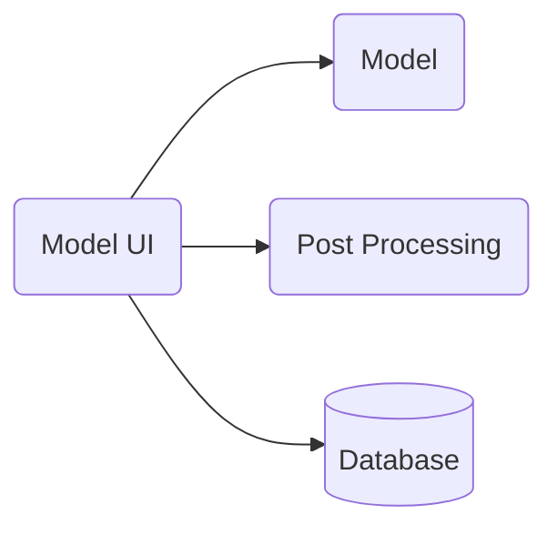
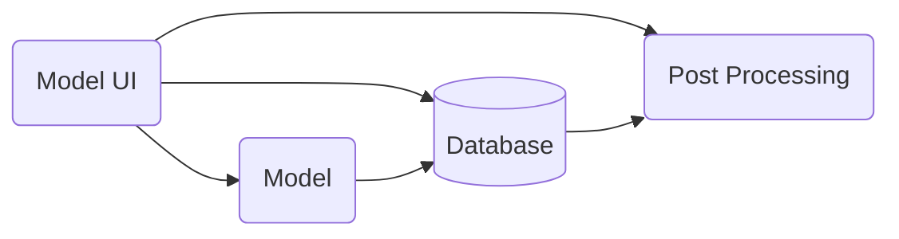

# WATDEV model UI

A user interface to interact with WATDEV models

The project [WATDEV](https://watdev.eu)  - Climate Smart WATer Management and Sustainable DEVelopment for Food and Agriculture in East Africa is funded by the DeSIRA initiative of the European Union and aims to develop an in-depth understanding of small and large-scale water and agricultural resource dynamics and management while boosting people’s resilience to climate, through innovative research, modelling, and capacity building approaches.

## Installation instructions

### PHP Apache

This setup requires a postgres database (local or on the network) and a Apache server with PHP pre installed.
Clone the repository to the server and setup apache to host the php folder.
Enable the .env file to set the proper credentials

### Docker

A docker compose setup has been prepared which installs the website and postgres database on a docker enabled server.
A docker image of the tool is available in GHCR.io

## Model UI 

The tool offers functionality to visualise model results and compare different scenario's.

### Users

2 types of users exist: 
- anonymous users, which can vizualise model runs which have been set as public
- advanced users, which can upload model results and update advanced parameters on the model

## Post processing

After the modelling backend is finished, some cost-benefit analysis post processing will occur, before the result is presented in the front-end. Some of the parameters may be changed on the UI, which only require post processing to be run again, without a full model run. To be investigated how the post processing accesses the various model run results (will there be a central database, or will the model-ui send the required results to post processing).

vs

Post processing calculates optimisation based on indicator weight. Model-UI should present for a set of indicators (yield, financial return, water availability) a weight scale how important the factor is for the user. And trigger post-processing again for a given model run (or compare 2 scenario's).

## Backend Delivery in phases

Seems the model backend will be delivered in phases (up to 2026), for each target-area the model needs to be configured separately with relevant source data. Egypt is likely the first area available. Suggestion would be to create mock responses for the other areas, so the ui development is not delayed. The model-ui should clearly indicate the status of the model backend, when selecting a region.

## Glossary

- HRU modelling area (fieldscale or region area, river catchment)
- BMP: Best Management Practice (intervention) 
- Indicators (cost/benefit, yield, )
- KPI - Key performance indicators

---

​The [WATDEV project](https://capacity4dev.europa.eu/projects/desira/info/watdev_en) is maintained with the financial support of the European Union. Its contents are the sole responsibility of the authors and do not necessarily reflect the views of the European Union.
