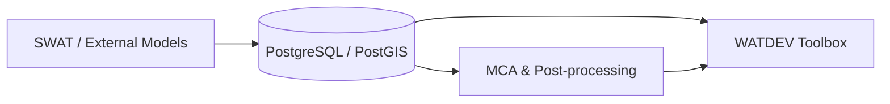
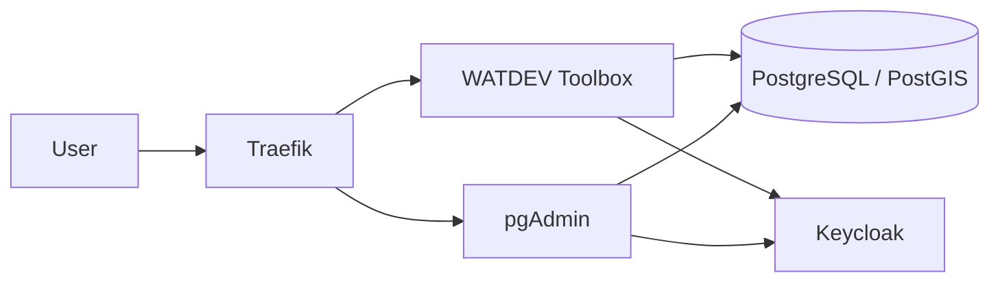

# WATDEV Toolbox

The WATDEV Toolbox is a web-based platform for exploring, comparing, and analysing agricultural and water-management scenarios derived from hydrological, agricultural, and socio-economic model outputs.

The toolbox provides:

- Interactive visualisation of model outputs
- Spatial exploration of study areas, subbasins, and river reaches
- Scenario comparison against baseline conditions
- Custom scenario creation by combining model results within a study area
- Multi-Criteria Analysis (MCA) for evaluating interventions and trade-offs
- Storage and management of study areas, model runs, indicators, user workspaces, and post-processing settings

---

## About WATDEV

The project [WATDEV](https://watdev.eu) — Climate Smart WATer Management and Sustainable DEVelopment for Food and Agriculture in East Africa — is funded by the DeSIRA initiative of the European Union.

WATDEV aims to develop an in-depth understanding of small- and large-scale water and agricultural resource dynamics and management, while boosting resilience to climate change through innovative research, modelling, and capacity-building approaches.

The toolbox is the main user interface for interacting with model results and post-processing workflows.

---

## User Roles

The toolbox supports different user profiles.

### Policy Users

Policy users interact with preconfigured scenarios and indicators through a simplified decision-support interface.

Typical tasks include:

- Exploring available study areas
- Comparing baseline and intervention scenarios
- Reviewing water, agricultural, and socio-economic indicators
- Evaluating trade-offs between scenarios
- Running MCA workflows with predefined or adjusted weights

### Advanced Users

Advanced users have access to additional functionality, including:

- Importing model outputs
- Publishing and documenting scenario results

### Admin User
 
Admin Users are able to manage back-end settings, including:
- Managing study areas and model runs
- Configuring MCA indicators, variables and presets
- Managing metadata, licences, and publication information

---

## Conceptual Architecture

The toolbox acts as a data-management, visualisation, and post-processing layer on top of external modelling systems.


```mermaid
flowchart LR
    M[SWAT / External Models]
    DB[(PostgreSQL / PostGIS)]
    UI[WATDEV Toolbox]
    PP[MCA & Post-processing]

    M --> DB
    DB --> UI
    DB --> PP
    PP --> UI
```

The modelling backend produces detailed model results outside the toolbox. These results are imported into the toolbox database, where they can be visualised, aggregated, combined, and used in post-processing workflows.

The toolbox stores information about:

- Study areas
- Model runs
- Spatial boundaries, subbasins, and river reaches
- Raw and aggregated model indicators
- Crop and irrigation context data
- Custom scenarios
- MCA indicators, variables, presets, and workspaces
- User-created analysis settings

---

## Data Workflow

### 1. Model Execution

Hydrological and agricultural models are executed outside the toolbox.

The toolbox does not directly run SWAT. Instead, it reads and stores model results after they have been generated by the modelling backend.

### 2. Import and Aggregation

Model outputs may be available at daily or monthly resolution. During import and post-processing, the toolbox derives yearly indicators that are used for efficient visualisation, comparison, and MCA calculations.

Examples of indicators include:

- Yield
- Biomass production
- Irrigation water use
- Nutrient uptake and application
- River discharge
- Sediment export
- Water availability indicators
- Financial or socio-economic indicators derived during post-processing

Yearly indicators are stored in the database and are linked to model runs, years, subbasins, and, where relevant, crops.

### 3. Scenario Analysis

Users can compare:

- Baseline model runs
- Alternative model runs
- Custom scenarios

A custom scenario combines model results for a specific study area by assigning different source model runs to different subbasins.

Example:

| Subbasin | Source Run            |
|---|-----------------------|
| 1 | Baseline              |
| 2 | Irrigation Scenario   |
| 3 | Agroforestry Scenario |

This allows users to construct mixed intervention portfolios without requiring a new model execution for every possible combination.

### 4. Post-processing and MCA

Post-processing fetches stored model results and combines them with user input, economic assumptions, crop-specific parameters, and indicator weights.

The MCA workflow allows users to:

- Select scenarios or custom scenarios
- Configure indicator weights
- Adjust economic and crop-specific variables
- Compare scenario performance
- Save reusable MCA workspaces

Changing MCA settings or post-processing assumptions does not require a new model run. The toolbox recalculates post-processing results based on the stored model outputs and the active user configuration.

---

## Core Data Model

The database combines model outputs with user-defined analysis objects.

### Study Areas

A study area represents a geographic region for which model results are available.

Each study area may contain:

- A study area boundary
- Subbasins
- River reaches
- Multiple model runs
- Enabled or disabled availability status

### Model Runs

A model run represents a completed model simulation.

Stored metadata includes:

- Run label
- Study area
- Run date
- Simulation period
- Time step
- Visibility
- Baseline status
- Author and creator information
- Publication URL
- Licence
- Download availability

Runs can be marked as baseline scenarios or alternative intervention scenarios.

### Spatial Data

Spatial data is stored using PostGIS.

The toolbox stores:

- Study area geometries
- Subbasin geometries
- River reach geometries
- Additional spatial properties as JSON metadata

### Model Output Tables

The toolbox stores several groups of SWAT-derived outputs:

| Table | Purpose |
|---|---|
| `swat_runs` | Metadata for imported model runs |
| `swat_indicator_yearly` | Aggregated yearly indicators used by the dashboard and MCA |
| `swat_crop_area_context` | Crop area context per run, subbasin, and crop |
| `swat_irrigation_area_context` | Irrigated area context per run, subbasin, year, and month |
| `swat_run_subbasins` | Mapping between model runs and available subbasins |

### Custom Scenarios

Custom scenarios allow users to combine model runs within one study area.

Relevant tables include:

| Table | Purpose |
|---|---|
| `custom_scenarios` | Stores custom scenario metadata |
| `custom_scenario_subbasin_runs` | Assigns source runs to subbasins within a custom scenario |

### MCA Configuration

The MCA system stores indicators, variables, presets, and user workspaces.

Relevant table groups include:

| Table Group | Purpose |
|---|---|
| `mca_indicators` | MCA indicator definitions |
| `mca_preset_sets` / `mca_preset_items` | Reusable MCA weight presets |
| `mca_variable_sets` / `mca_variable_values*` | User-configurable MCA variables |
| `mca_workspaces` | Saved user MCA workspaces |
| `mca_workspace_*` | Workspace-specific copies of selected datasets, variables, crop parameters, run-specific factors, and indicator weights |

The workspace tables allow MCA analyses to be reproduced even when defaults or global variables change later.

---

## Technology Stack

The toolbox uses:

- PHP application backend
- JavaScript frontend
- PostgreSQL
- PostGIS
- Docker
- Docker Compose
- Keycloak for authentication
- Traefik for production routing and TLS termination
- pgAdmin for database administration in production deployments

---

## Repository Layout

A typical production-oriented layout is:

```text
project-root/
├── docker-compose.prod.yml      # Production Compose file
├── .env                         # Environment file, copied from .env.prod.example
├── pgadmin/
│   ├── Dockerfile               # Custom pgAdmin image
│   ├── entrypoint.sh            # Renders pgAdmin config from environment variables
│   └── servers.json.template    # pgAdmin DB connection template
├── Dockerfile                   # Main application image
├── db/
│   └── Dockerfile               # Database image/configuration
└── src/                         # Application source code
```

---

## Production Deployment

### Requirements

- Docker Engine
- Docker Compose
- A shared external Docker network named `proxy`
- DNS pointing to the production server
- Keycloak configured for the toolbox domain

### 1. Create the environment file

```bash
cp .env.prod.example .env
```

Edit `.env` and replace all placeholder values, especially secrets, hostnames, database credentials, and Keycloak settings.

### 2. Create the external Docker network

Traefik and the application services share a network named `proxy`.

Create it once on the host:

```bash
docker network create proxy
```

The network persists across `docker compose down`.

### 3. Deploy

```bash
docker compose -f docker-compose.prod.yml --env-file .env up -d
```

---

## Production Stack

The production deployment consists of:

- WATDEV Toolbox application
- PostgreSQL/PostGIS database
- pgAdmin
- Keycloak authentication
- Traefik reverse proxy
- Let's Encrypt certificates


```mermaid
flowchart LR
    User[User] --> Traefik[Traefik]
    Traefik --> Toolbox[WATDEV Toolbox]
    Traefik --> PgAdmin[pgAdmin]

    Toolbox --> DB[(PostgreSQL / PostGIS)]
    PgAdmin --> DB

    Toolbox --> Keycloak[Keycloak]
    PgAdmin --> Keycloak
```

---

## Keycloak Configuration

In the Keycloak admin console, configure the toolbox client and pgAdmin access.

### pgAdmin OAuth Redirect URI

Add the following valid redirect URI:

```text
https://toolbox.watdev.eu/pgadmin/oauth2/authorize
```

### Web Origins

Add the toolbox domain to Web Origins:

```text
https://toolbox.watdev.eu
```

### pgAdmin Admin Role

Create a client role named `admin` inside the `watdev-toolbox` client.

Then assign the role to every user who should have pgAdmin access:

```text
Users → [user] → Role Mappings → Client Roles → watdev-toolbox → admin
```

The pgAdmin OAuth configuration checks whether the user's JWT contains:

```text
resource_access.watdev-toolbox.roles
```

including:

```text
admin
```

Users without this role are denied access at the OAuth2 layer before they reach pgAdmin.

---

## pgAdmin Database Registration

The file `servers.json.template` is rendered at container startup by `entrypoint.sh` using environment-variable substitution. This ensures that the database connection reflects the active `.env` values.

However, pgAdmin only seeds the server list from `servers.json` on the first start, when the `pgadmin_data` volume is empty. Later restarts regenerate the file, but pgAdmin ignores it once the volume already contains user data.

To re-seed pgAdmin after changing values such as `DB_HOST` or `DB_NAME`:

```bash
docker compose -f docker-compose.prod.yml down -v
docker compose -f docker-compose.prod.yml up -d
```

> [!WARNING]
> This removes the `pgadmin_data` volume and clears saved queries, preferences, and pgAdmin user data.

For a connection-only change, it is usually safer to log in as the bootstrap admin and edit the registered server manually.

---

## Let's Encrypt Staging Mode

While testing production deployment, enable the Let's Encrypt staging certificate authority in `docker-compose.prod.yml` by uncommenting the staging CA line.

Production mode:

```yaml
# - "--certificatesresolvers.letsencrypt.acme.caserver=https://acme-staging-v02.api.letsencrypt.org/directory"
```

Testing mode:

```yaml
- "--certificatesresolvers.letsencrypt.acme.caserver=https://acme-staging-v02.api.letsencrypt.org/directory"
```

Staging certificates are not trusted by browsers, but they do not consume the production Let's Encrypt rate-limit quota.

After testing:

1. Comment the staging CA line again.
2. Remove the Let's Encrypt volume.
3. Restart the production stack.

```bash
docker compose -f docker-compose.prod.yml down
docker volume rm <project>_letsencrypt
docker compose -f docker-compose.prod.yml up -d
```

---

## Test Server vs Production Deployment

| Aspect | Test Server | Production |
|---|---|---|
| Compose file | `docker-compose.yml` | `docker-compose.prod.yml` |
| SSL | None | Let's Encrypt via Traefik |
| Port 80/443 | Not used | Traefik listens on both |
| Database port | Exposed on `5432` | Internal only, no host binding |
| pgAdmin | Not included | Available under `/pgadmin` via Traefik |
| Networks | Default bridge | `proxy` and `internal` |

---

## Development Status

The toolbox is designed to support multiple WATDEV study areas.

Study areas can be enabled independently as model outputs become available. This allows UI development, dashboard testing, and workflow configuration to continue even when model results for some regions are still under preparation.

The database can store mock or preliminary model results where needed to support frontend and post-processing development before final backend outputs are available.

---

## Glossary

| Term | Description |
|---|---|
| HRU | Hydrological Response Unit |
| BMP | Best Management Practice or intervention |
| MCA | Multi-Criteria Analysis |
| KPI | Key Performance Indicator |
| Study Area | Geographic region containing model results |
| Scenario | A model run or custom combination of model runs |
| Baseline | Reference scenario used for comparison |
| Subbasin | Spatial modelling unit within a study area |
| Reach | River segment used in model outputs |
| Post-processing | Calculations performed after model results are available, using stored outputs and user input |

---

## Funding and Disclaimer

The [WATDEV project](https://capacity4dev.europa.eu/projects/desira/info/watdev_en) is maintained with the financial support of the European Union.

Its contents are the sole responsibility of the authors and do not necessarily reflect the views of the European Union.
